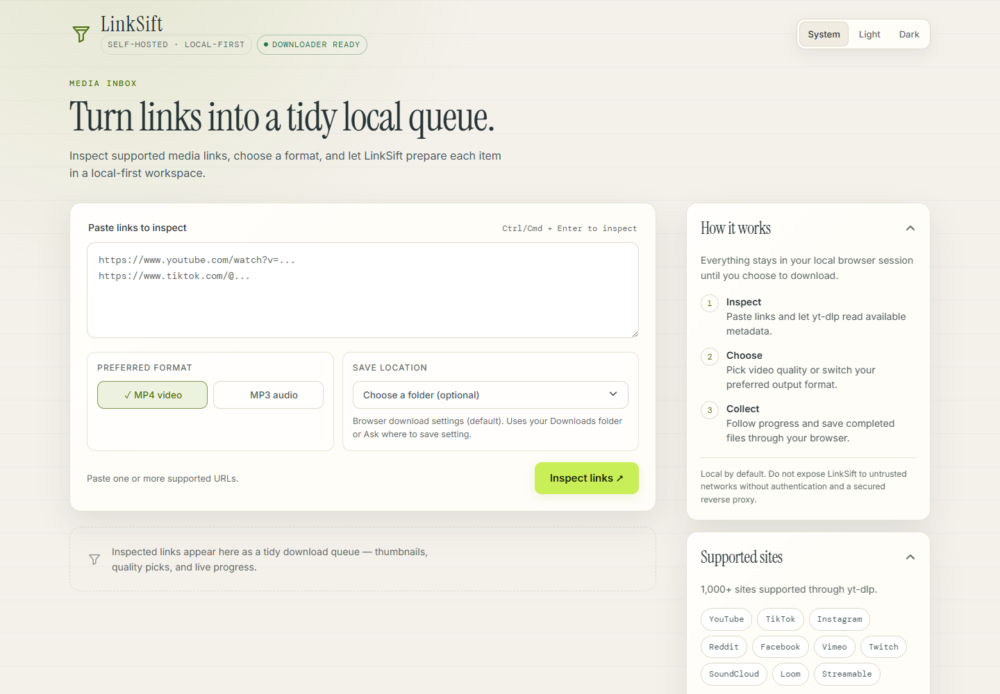
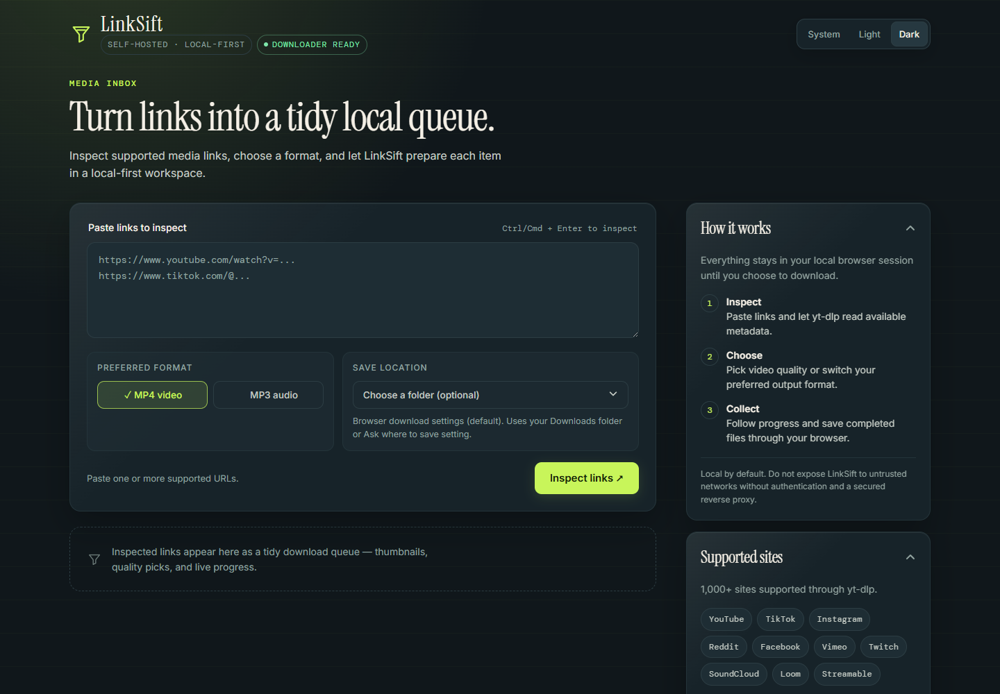
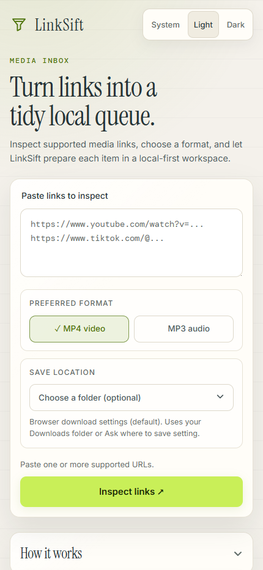

# LinkSift

<p align="center">
  <strong>Turn links into a tidy local queue.</strong><br>
  A focused, self-hosted media downloader powered by <a href="https://github.com/yt-dlp/yt-dlp">yt-dlp</a> and ffmpeg.
</p>

<p align="center">
  <a href="https://github.com/loveisbl1nd/linksift/actions/workflows/ci.yml"></a>
  <a href="LICENSE"></a>
  <a href="https://github.com/yt-dlp/yt-dlp"></a>
</p>

LinkSift lets you inspect supported media URLs, choose MP4 or MP3 output, select a quality, and save the result through a clean local web interface. It is designed for personal, authorized use: your links, job state, and downloaded files stay in the local workspace you control.

> Respect copyright law, platform terms, and creators' rights. LinkSift does not support DRM circumvention or bypassing access controls.

## Screenshots

<p align="center">
  
</p>

<p align="center">
  
</p>

<p align="center">
  
</p>

## Highlights

- **Local-first workflow** — runs on your machine and binds to localhost by default.
- **MP4 or MP3** — choose a preferred output format before inspecting links.
- **Quality selection** — pick an available video height when the source provides it.
- **Batch-friendly queue** — paste one or more supported URLs and process them in sequence.
- **Live progress** — see phase, percentage, speed, ETA, and final file status.
- **Browser save controls** — optionally choose a destination folder in Chromium-based browsers.
- **Docker-first runtime** — includes Python, yt-dlp, ffmpeg, Gunicorn, and a non-root user.
- **Offline regression suite** — tests mock external tools instead of calling media platforms in CI.

## Quick start

Install Docker Desktop, then run:

```bash
docker compose up --build
```

Open <http://localhost:8899>. The service is bound to your local machine by default; no host Python, yt-dlp, or ffmpeg installation is required.

Downloads persist in the named `linksift-downloads` Docker volume.

## How it works

1. **Inspect** — paste one or more URLs and let yt-dlp read available metadata.
2. **Choose** — select MP4/MP3 and, where available, a video quality.
3. **Collect** — follow progress and save completed files through the browser.

## Development

Local development is for contributors. Install Python 3.12, yt-dlp, and ffmpeg, then run:

```bash
./linksift.sh
```

See [CONTRIBUTING.md](CONTRIBUTING.md) for tests, Docker smoke checks, and pull request expectations.

## Configuration

| Variable | Default | Description |
| --- | ---: | --- |
| `PORT` | `8899` | HTTP port used by the development server. |
| `HOST` | `127.0.0.1` | Bind address. Keep local unless protected by a reverse proxy. |
| `LINKSIFT_DOWNLOAD_TIMEOUT` | `3600` | Maximum seconds for one yt-dlp process. |
| `LINKSIFT_MAX_CONCURRENT_DOWNLOADS` | `3` | Maximum simultaneous downloads in the in-memory worker. |
| `LINKSIFT_NO_UPDATE` | unset | Set to `1` to skip the startup yt-dlp update. |

Job state lives in memory, so the included Gunicorn configuration uses one worker. Restarting the service clears active job status. Do not add workers until job state moves to shared storage.

## Supported sites

LinkSift accepts sites supported by [yt-dlp](https://github.com/yt-dlp/yt-dlp/blob/master/supportedsites.md), including YouTube, TikTok, Instagram, Reddit, Facebook, Vimeo, Twitch, SoundCloud, Loom, Streamable, Pinterest, Tumblr, Threads, LinkedIn, and many more.

## Security and network exposure

LinkSift accepts URLs for yt-dlp to process and has no built-in authentication. **Do not expose it directly to the internet or an untrusted LAN.** If remote access is required, place it behind a reverse proxy with TLS, authentication, rate limiting, and egress controls that you operate.

For vulnerability reports, use GitHub's [private vulnerability reporting](https://github.com/loveisbl1nd/linksift/security/advisories/new) instead of opening a public issue. See [SECURITY.md](SECURITY.md) for the project policy.

## Validation

Tests are deliberately offline and mock external download tools. Run the suite before opening a pull request:

```bash
python -m unittest discover -s tests -v
python -m py_compile app.py
docker compose config
```

## Contributing

Bug reports, documentation improvements, tests, and focused pull requests are welcome. Read [CONTRIBUTING.md](CONTRIBUTING.md), [SECURITY.md](SECURITY.md), and the issue templates before contributing.

## License

[MIT](LICENSE) © 2026 thaiprovip
